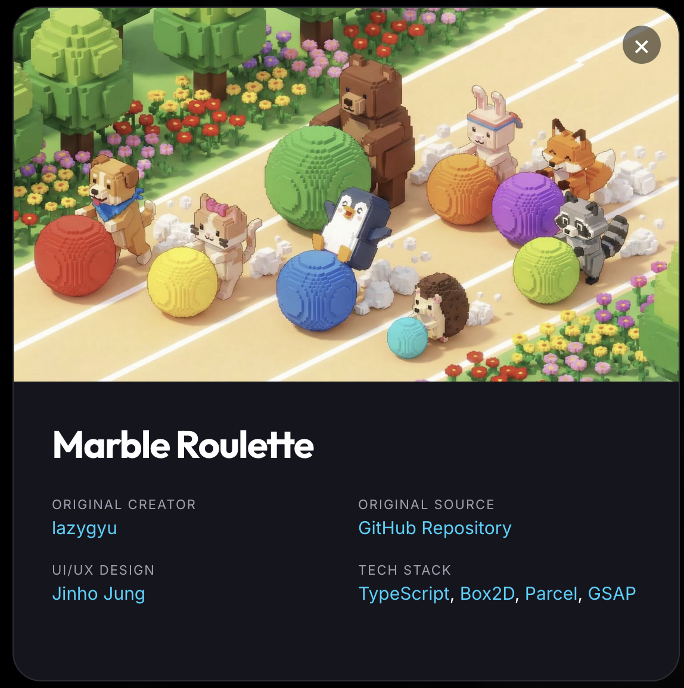
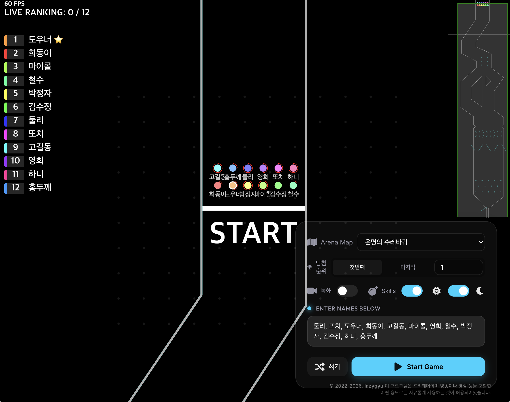
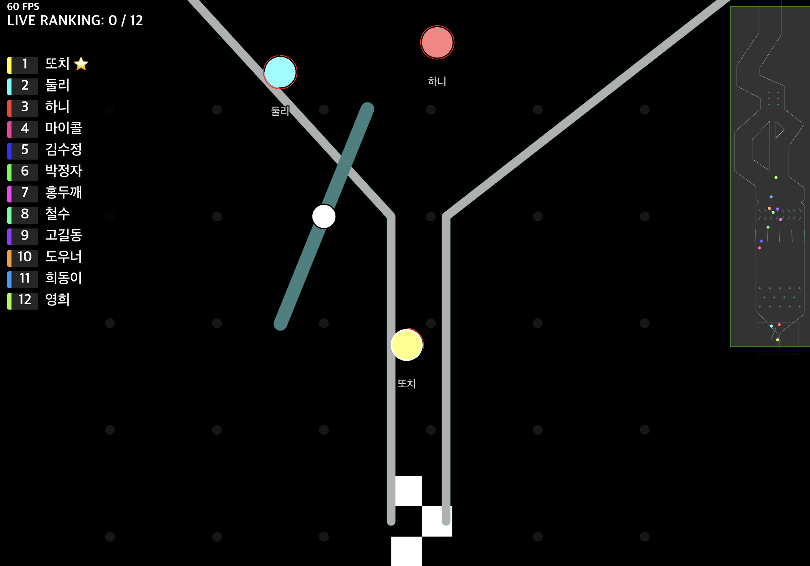
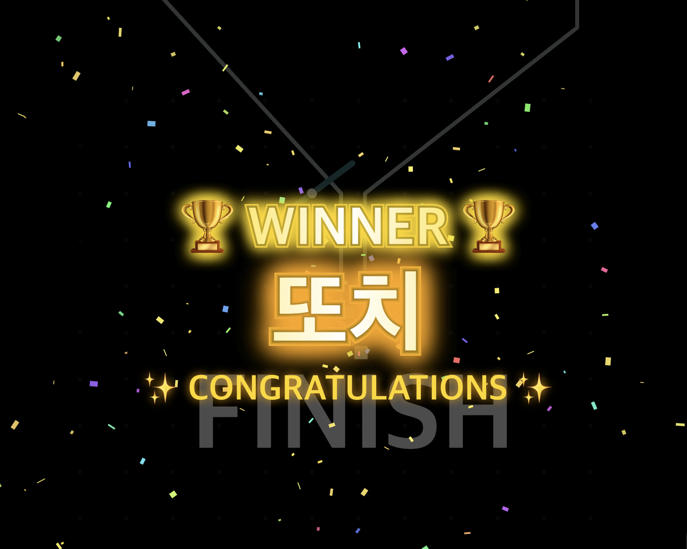

# 🏆 Marble Roulette (마블 룰렛)

환영합니다! **Marble Roulette**는 물리 엔진 기반의 화려하고 박진감 넘치는 구슬 달리기 추첨 시스템입니다.  
시청자 참여형 방송, 이벤트 추첨, 혹은 단순한 재미를 위해 설계되었습니다.

🚀 **[지금 바로 레이스 시작하기](https://jvibeschool.org/BALL/)**

---

## 📸 Screenshots (스크린샷)

|  |  |
| :---: | :---: |
| **메인 레이스 화면** | **실시간 랭킹 시스템** |
|  |  |
| **우승 축하 및 꽃가루 효과** | **프로젝트 정보 및 스플래시** |

---

## ✨ 주요 특징 (Key Features)

*   **🏎️ 리얼 물리 시뮬레이션**: Box2D 엔진을 사용한 정교한 구슬 움직임과 충돌 구현.
*   **📈 고주사율 지원**: MacBook Pro의 ProMotion(120Hz)을 완벽 지원하여 극한의 부드러움을 제공.
*   **📊 실시간 레이스 리더보드**: F1 스타일의 세련된 UI로 실시간 순위와 기록을 체킹.
*   **🎉 화려한 우승 축하**: 골인 지점 통과 시 화려한 황금빛 폭죽과 함께 우승자 선언.
*   **🔗 편리한 사용성**: 이름 목록을 입력하고 셔플 한 번이면 레이스 준비 끝!
*   **🎨 프리미엄 디자인**: 다크 모드 기반의 글래스모피즘 UI와 세련된 도트 배경 패턴.

---

## 🛠️ 사용 방법 (How to Use)

1.  **이름 입력**: 오른쪽 하단 설정창의 입력란에 참가자들의 이름을 넣습니다 (쉼표나 줄바꿈으로 구분).
2.  **맵 선택**: 레이스를 펼칠 아레나 맵을 선택합니다.
3.  **옵션 설정**: 녹화 여부, 구슬 스킬 사용 여부 등을 결정합니다.
4.  **레이스 시작**: `Start Game` 버튼을 누르면 카운트다운과 함께 경기가 시작됩니다!

---

## 💻 기술 스택 (Tech Stack)

*   **Language**: [TypeScript](https://www.typescriptlang.org/)
*   **Physics**: [Box2D](https://box2d.org/)
*   **Bundler**: [Parcel](https://parceljs.org/)
*   **Animation**: [GSAP](https://greensock.com/gsap/)
*   **Icons**: [Font Awesome](https://fontawesome.com/) & Custom SVGs

---

## 👥 참여자 (Contributors)

*   **Original Creator**: [lazygyu](https://lazygyu.net)
*   **UI/UX Enhancement & High-Hz Optimization**: [Jinho Jung](mailto:jvisualschool@gmail.com) (2026)

---

## 📜 라이선스 (License)

이 프로그램은 **프리웨어**입니다.  
방송, 영상 제작 등 어떤 용도로든 **자유롭게 사용하는 것이 허용**되어 있습니다. 멋진 레이스를 즐기세요!

---
© 2022-2026. **Marble Roulette Project**. All Rights Reserved.
